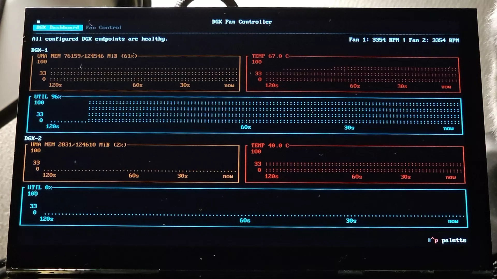

# DGX Fan Controller TUI (MVP)

[한국어 README](README.ko.md)

`dgx-fan` is a Python Textual application for a Raspberry Pi 4. It reads GPU data from up to two DCGM exporter endpoints and drives two 4-wire PWM fans independently or in a linked higher-demand mode. The dashboard shows GPU memory, utilisation, and temperature, along with each fan's status. Since DCGM cannot report DGX Spark memory information, node_exporter can provide unified-memory usage for each DGX.



&nbsp;

## Easy installation and launch (Raspberry Pi)

Install [`uv`](https://docs.astral.sh/uv/getting-started/installation/) first, then clone the project and run the installer as your regular login user:

```bash
git clone <repository-url> dgx-fan
cd dgx-fan
./install.sh
```

On the first run, the installer creates `config.toml` if it is missing and stops. Edit that file with your DGX URLs and set `hardware.backend = "raspberry-pi"`, then run `./install.sh` again. When the system is ready, installation opens a menu for the terminal or HDMI display and the optional web monitor. A first installation may instead ask you to reboot or log in again; afterward, use `./dgx-fan-control.sh` for normal launches without reinstalling.

For removal, run `./uninstall.sh` and answer its default-No confirmation. Use `./uninstall.sh --yes` only for intentional non-interactive removal. Uninstall keeps the clone and `config.toml`. See the [detailed Raspberry Pi installation and display guide](#raspberry-pi-installation-and-display) for prerequisites, direct commands, and retained system settings.

## Development and manual execution

Use Python 3.11+ and install the development environment:

```bash
uv venv
uv pip install -e '.[dev]'
cp config.example.toml config.toml
```

Activate the environment to use its Python or console entry point:

```bash
source .venv/bin/activate
python -m dgx_fan --config config.toml
# or: dgx-fan --config config.toml
```

Alternatively, run through uv without activation:

```bash
uv run dgx-fan --config config.toml
```

Do not substitute `/usr/bin/python`: it does not see this repository's `src/` package unless the project is installed there. Configuration lookup is `--config`, then `DGX_FAN_CONFIG`, then `./config.toml`. The Fan Control settings screen can persist and apply its supported runtime fields; endpoint, wiring, and web-listener edits still require a restart. Begin on a development machine with `hardware.backend = "fake"`.

## Raspberry Pi installation and display

Keep the editable `config.toml` in the clone; `install.sh` does not copy it to `/etc`.

```bash
git clone <repository-url> dgx-fan
cd dgx-fan
cp config.example.toml config.toml
# Edit DGX URLs and set [hardware] backend = "raspberry-pi".
./install.sh --reboot
```

Install `uv` first using the [official instructions](https://docs.astral.sh/uv/getting-started/installation/) if needed. The installer runs `uv sync --locked --extra raspberry-pi --no-dev`, validates the clone-local configuration, adds the dual-PWM overlay, and configures Raspberry Pi 4 tty1 console auto-login. If `config.toml` is absent, it creates a copy and stops so you can edit it. Run `./install.sh` without `--reboot` to install first and reboot manually afterward, or use `./install.sh --dry-run` to inspect its action. A successful interactive install opens the launcher once when the PWM device and active `gpio` group are ready; otherwise it tells you to reboot or log in again. `--no-launch` performs installation only.

The app itself runs as the regular user, never as root. For the usual interactive launch, run:

```bash
./dgx-fan-control.sh
```

Choose the current terminal or the attached HDMI display, then choose whether to start the optional browser view. Before starting, the launcher checks whether this clone owns a complete installation. Missing, partial, or another-clone installations require an explicit default-No confirmation before the launcher runs `install.sh --no-launch`, rechecks readiness, and resumes. It is read-only by default; control is an explicit trusted-LAN opt-in described below. In current-terminal mode the app stays in the foreground; in HDMI mode the tty8 display service continues after SSH disconnects. A normal **Ctrl+Q** exit from the terminal leaves a web monitor selected by the launcher running. If the primary terminal startup fails, the launcher stops only a web monitor that it itself started.

To stop the managed HDMI display and optional browser monitor together, without prompts:

```bash
./dgx-fan-control.sh stop
```

It stops the browser monitor first and always then attempts the HDMI display clean-stop path. This does not stop a foreground current-terminal TUI; return to that terminal and use **Ctrl+Q**.

The direct commands remain available for automation and troubleshooting. Launch in the current terminal with:

```bash
./scripts/start.sh
```

To place the TUI on the connected HDMI display from SSH:

```bash
./scripts/display.sh restart
./scripts/display.sh status
sudo journalctl -u dgx-fan-display.service --no-pager
```

The transient display process runs on tty8 and continues after SSH disconnects. With `shutdown_mode = "off"`, **Ctrl+Q**, `./scripts/display.sh stop`, and the stop phase of `./scripts/display.sh restart` use the clean-stop path and command 0% duty. Handled abnormal termination uses the full-duty fail-safe; SIGKILL and power loss cannot run cleanup and may preserve the last duty. Do not start a second foreground `./scripts/start.sh` while the display is active; the hardware-owner lock rejects it without stopping the running app. `uv run dgx-fan --config config.toml` and `uvx` remain foreground terminal commands.

## Browser monitor and trusted-LAN control

The optional browser view renders the same Textual `DGX Dashboard` and `Fan Control` tabs, including RPM, charts, gauges, and controller-authoritative settings. It is **READ ONLY by default**: browser visitors cannot toggle fans or change configuration, and the renderer never acquires GPIO/PWM ownership.

Enable it in `config.toml`, then restart the primary controller so it creates the local monitor socket:

```toml
[web]
enabled = true
allow_control = false # Default; read the warning below before changing this.
host = "0.0.0.0" # Trusted private LAN; keep 127.0.0.1 for local-only access.
port = 8000
```

Start it independently from the display process:

```bash
./scripts/web.sh start
./scripts/web.sh status
# Stop only the browser renderer; the physical controller keeps running.
./scripts/web.sh stop
```

`scripts/web.sh` creates a transient `systemd --user` service, so it is not installed or auto-started by `install.sh`. It normally persists after an SSH disconnect while the Raspberry Pi's console auto-login user session remains active. If you operate without that session, enable user lingering once (`sudo loginctl enable-linger "$USER"`) before relying on an SSH-started browser service. The default `web.host = "127.0.0.1"` is local-only and works with an SSH tunnel such as `ssh -L 8000:127.0.0.1:8000 <pi>`.

Setting `web.allow_control = true` enables Save and Apply plus explicit fan On/Off for **every browser visitor, without a login**. Use it only on a trusted private LAN. The controller remains the sole file and hardware owner, rejects stale revisions and external file edits, and preserves safety overrides even when requested power is Off. For LAN access, also set `web.host = "0.0.0.0"`, restart the primary controller and browser renderer, then browse to `http://<current-pi-ip>:8000`. The wildcard follows DHCP/subnet changes but does not authenticate or filter clients. Never port-forward this port or expose it through a WAN firewall; use read-only mode or a separately authenticated network boundary for untrusted access.

Remove only this project's integration while retaining the clone and configuration:

```bash
./uninstall.sh
```

Uninstall asks for a default-No confirmation; use `./uninstall.sh --yes` for deliberate non-interactive removal. It stops the current-user browser service and then attempts the transient display clean-stop even if the browser stop fails. Any real stop or cleanup failure preserves all managed integration files for retry. Configuration, source, `.venv`, the PWM overlay, and console auto-login remain. Disable auto-login with `sudo raspi-config` and remove the exact overlay (or restore its backup) only when required.

Direct operational scripts moved from the repository root to `scripts/`. Existing installations must rerun `./install.sh` after updating so the managed tty/profile paths point to the new locations; no permanent root-level compatibility wrappers are installed.

## Configuration and safe operation

`config.example.toml` is a schema-v2 starting point. Copy it to `config.toml`. In the Fan Control tab, **Setting** opens the shared editor; its Collection, Fan Speed, Fan Control, Hardware, and Colors tabs show one section at a time while the Save/Cancel actions stay fixed. Fan Speed keeps the four threshold/speed pairs in compact rows. **Save and Apply** validates the complete configuration, preserves comments and unrelated fields, writes an ignored `*.toml.bak`, then applies the acknowledged revision. Safe compare-and-swap replacement requires Linux `renameat2(RENAME_EXCHANGE)` support from the kernel and configuration filesystem; unsupported filesystems reject the save without using an overwrite fallback. **Cancel** never changes disk or runtime state. A failed or stale save leaves the draft visible in the open editor; copy any values you need before cancelling and reopening the current controller settings. An external manual file edit is rejected until the controller is restarted. A slow accepted browser save is retried with the same request identity; if it cannot be reconciled in the bounded client window, the editor reports the outcome as uncertain, refreshes the authoritative revision when possible, and keeps the draft for verification instead of claiming failure. Startup enablement affects the next launch, shutdown mode affects the next clean exit, and startup boost duration affects subsequent boost events. Endpoint URLs, low-level wiring/backend values, and web listener/access settings remain file-and-restart changes.

### Schema and DGX endpoints

| Field | Meaning and accepted value |
| --- | --- |
| `version` | Required integer. Must be `2`. |
| `[[dgx]]` | One or two endpoint tables. `id` and `name` are non-empty, unique strings; `url` is a non-empty `http://` or `https://` DCGM `/metrics` URL. |
| `dgx.memory_source` | Optional: `"dcgm"` (default) for DCGM framebuffer memory, or `"node-exporter"` for host UMA memory. It changes dashboard memory only, never fan control. |
| `dgx.node_exporter_url` | Required non-empty `http(s)` URL when `memory_source = "node-exporter"`; forbidden with `"dcgm"`. DCGM GPU temperature and utilisation remain required. |

### Dashboard colours

`[dashboard.colors]` is optional. `memory`, `utilization`, and `temperature` independently set the foreground colour of their charts. The Colors tab offers Default plus Rich's 16 standard ANSI slots (`black` through `white` and `bright_black` through `bright_white`) with visual swatches; Default omits that field. An existing valid custom name or `#RRGGBB` value appears as **Current custom** and is preserved until explicitly replaced. Manual configuration may still use any valid Rich foreground colour name or exact `#RRGGBB`; `"default"` is not accepted as a stored value. On an 8-colour terminal, bright presets may render the same as their base colours.

### Browser monitor

| Field | Meaning and validation |
| --- | --- |
| `web.enabled` | Optional boolean; defaults to `false`. When true, the primary controller publishes its bounded monitor state. Restart the primary app after changing it. |
| `web.allow_control` | Optional boolean; defaults to `false`. When true, every visitor can edit all fields exposed by the settings screen and request explicit fan On/Off without login. Trusted private LAN only; restart the primary app and browser renderer after changing it. |
| `web.host` | Optional numeric loopback address; defaults to `127.0.0.1`. Exactly `0.0.0.0` is also allowed as an explicit, unauthenticated trusted-LAN bind; browse `http://<current-pi-ip>:8000`. CIDR strings, hostnames, IPv6 wildcard, and unicast/multicast/link-local/reserved addresses are rejected. Do not port-forward or open this listener to WAN. |
| `web.port` | Optional integer `1..65535`; defaults to `8000`. |
| `web.socket_path` | Optional absolute Unix-socket path. Defaults to `.dgx-fan-monitor.sock` beside the configuration file. The monitor socket and sibling control socket are same-user mode `0600` and removed when the primary app exits. Browser processes never access hardware directly. |

Browser clients receive a complete versioned replacement snapshot containing the current 120-second chart history, effective colors/cadence, settings revision, and requested power. Settings and power stay disabled until a fresh, compatible controller frame is present, and disable again on a legacy frame, disconnect, controller identity change, or publisher stall. Older revisions are ignored; malformed, publish-error, disconnected, or stalled monitor data is shown as a monitor-stream state rather than being treated as healthy telemetry. On controller shutdown, new mutations and listeners close before the hardware is commanded to fail-safe full duty; accepted persistence receives only a bounded reconciliation grace. Kernel-uninterruptible filesystem I/O can still delay process exit and the final clean-`off` release, but it does not postpone the preceding safe-full duty command. Starting, stopping, reconnecting, or pressing browser **Ctrl+Q** affects only that renderer and never stops the primary controller. Open the served URL without `?delay`; textual-serve connects automatically and replaces its launch page as soon as the monitor stream starts.

### History

The shared **History** tab retains up to eight days of original DCGM and configured node-exporter responses in `data/history.sqlite3` beside the active configuration. The primary controller is the sole writer; local and browser views request only a selected endpoint, UTC range, and bounded chart width. Browser history remains read-only and is available even when `web.allow_control = false`; it never starts another collector or receives eight days of raw data in the live monitor stream.

Memory, UTIL, temperature, and GPU power are plotted with gaps for missing samples. GPU power is **N/A** when the exporter cannot provide a complete physical-GPU value. Queue, storage, or query warnings appear in History and do not stop fan control. The database and SQLite sidecars are ignored by Git and are preserved across restarts, install, and uninstall; remove them manually only when intentionally discarding stored history.

Choose a DGX endpoint in History. It opens on the latest hour; use **+**/**−** for 1 minute, 10 minutes, 1 hour, 6 hours, 1 day, or 8 days. Opening History or changing zoom resumes live following at the latest range; drag or use arrow keys to hold and inspect a past range. The four bordered charts are kept on one compact screen without numeric vertical ticks. Power uses a fixed **240 W** display scale, so values above 240 W are visually capped but remain unchanged in stored data. Raw `DCGM_*` and configured `node_memory_*` responses are filtered into the store at collection cadence. Per column, Memory is a mean and UTIL, temperature, and summed physical-GPU power are maxima. The exact eight-day cutoff is maintained on startup and once per minute; cleanup is chunked and resumes at the next start if the app exits mid-cleanup. Database size varies with exporter response cardinality and gaps.

### Collection

| Field | Meaning and validation |
| --- | --- |
| `collection.interval_seconds` | Poll interval in seconds; finite number `>= 0.1`. |
| `collection.timeout_seconds` | Per-request DCGM timeout in seconds; finite number `>= 0.1`. |
| `collection.stale_after_seconds` | Maximum age of cached telemetry in seconds; finite number `>= 0.1` and at least `interval_seconds`. Older data is unsafe for fan control. |
| `collection.retry_count` | Extra DCGM requests after the initial request; integer `>= 0` (defaults to `0` if omitted). Transport errors and HTTP 408, 429, and 5xx can retry. |
| `collection.retry_delay_seconds` | Delay between retry attempts in seconds; finite number `>= 0` (defaults to `10.0` if omitted). |

Each DGX is collected independently. A fresh cached sample can be used only until `stale_after_seconds`; stale or exhausted DCGM temperature telemetry activates the fan fallback. Node exporter failure affects the optional memory display, not DCGM endpoint health or fan safety.

### Fan control

| Field | Meaning and validation |
| --- | --- |
| `control.fan_endpoint_ids` | Required two-item array in **Fan 1, Fan 2** order. Each item must reference a configured `[[dgx]].id`. Repeat one ID when both fans cool the same DGX. Each fan uses the highest valid GPU temperature at its mapped endpoint. |
| `control.fan_mode` | Optional `"independent"` (default) or `"linked"`. Independent uses each mapped endpoint's own hysteresis-aware, normal-cap-limited curve demand. Linked applies the higher of those two demands to both fans; it does not average temperatures. Startup/tach boost also makes both outputs follow the higher final duty. |
| `control.enabled_at_startup` | Required boolean. `true` starts normal automatic control; `false` starts in user-Off state unless safety override is active. |
| `control.max_speed_percent` | Required integer `1..100`. Caps normal stage duty only. |
| `control.fallback_speed_percent` | Optional integer `0..100`, default `100`. Duty for both fans before the first valid sample and during safety override; it is independent of `max_speed_percent`. |
| `control.hysteresis_celsius` | Required finite number `>= 0`; prevents a fan from immediately dropping to a lower stage when temperature fluctuates. |
| `control.emergency_temperature_celsius` | Required finite number `>= 0`. Any valid GPU temperature at or above it activates fallback for both fans. |
| `control.recovery_seconds` | Required finite number `>= 0`. Safety-recovery dwell, described below. |

Select **Independent** or **Linked (higher demand)** in **Setting > Fan Control**, then **Save and Apply** to persist and apply it live. Changing only this mode retains endpoint mappings, per-endpoint stages/hysteresis, and safety/boost state; it changes output coordination on the next evaluation. Manual `config.toml` edits require a controller restart. The normal cap still applies before linked demands are compared; safety fallback remains independent of that cap. Run the updated controller and display/web monitor code together so both editors expose the same setting.

#### Safety override

Safety override has priority over normal control and UI Off. It drives **both** fans at `fallback_speed_percent` (default `100`), without applying `max_speed_percent`, in independent and linked modes. The displayed reason is one of:

- `endpoint unavailable`: a configured DCGM endpoint has no prior sample (including before its first sample), is stale, or has a terminal collection error. A retry can continue to use a fresh prior sample; not every transient request failure immediately activates fallback, but a terminal error does even while a cache is fresh.
- `no valid GPU temperature`: either fan's mapped endpoint has no valid GPU temperature.
- `fan stalled`: a fan had positive duty with no tach, used its one tach-retry startup boost, then remained without tach for the next `stall_timeout_seconds`. This latch remains unsafe until the app is restarted; turning Off or saving settings does not clear it. Inspect the fan and wiring before restarting.
- `emergency temperature`: any collected valid GPU temperature, including an unmapped endpoint, is at least `emergency_temperature_celsius`.

Node exporter failure affects only the optional memory display and does not trigger this override. `STARTUP BOOST` is a separate normal-control state, not a safety reason. During recovery, the displayed reason is `safety recovery temperature` until the temperature boundary is met, then `safety recovery dwell` while the timer runs. After every safety condition clears, the maximum valid GPU temperature must remain **strictly below** `emergency_temperature_celsius - hysteresis_celsius` continuously for `recovery_seconds`; any interruption resets the dwell. With the default 75°C emergency threshold, 2°C hysteresis, and 10-second recovery, temperatures must stay below 73°C for 10 seconds. This dwell is **not** used for ordinary stage changes. Lowering `fallback_speed_percent` also lowers emergency and stalled-fan output; low-level PWM/GPIO failures retain their separate full-speed recovery behavior.

#### `[[control.stages]]`: four-stage temperature curve

Exactly four stage tables are required. The first three require `max_temperature_celsius` (finite numbers `>= 0`, strictly ascending); the fourth must omit it and is open-ended. Every `speed_percent` is an integer `0..100`, and stage speeds must be non-decreasing. A stage upper boundary is inclusive: with `max_temperature_celsius = 50`, 50.0°C selects that stage, while any value above 50 selects the next applicable stage.

Stage changes upward happen immediately on the next collection/control update. When temperature falls, the controller holds the current higher stage until it is at or below the newly selected stage's upper boundary minus `hysteresis_celsius`.

For example, with stages `<= 50°C: 20%`, `<= 55°C: 60%`, and `hysteresis_celsius = 2`, a fan that reached the 60% stage remains at 60% at 49°C. It falls to the 20% stage only at **48°C or below**. There is no normal-curve time delay; `recovery_seconds` only applies after a safety override.

### Hardware

| Field | Meaning and validation |
| --- | --- |
| `hardware.backend` | Required: `"fake"` for development or `"raspberry-pi"` for Linux PWM/GPIO hardware. |
| `hardware.pwm_gpio_bcm` | Required two distinct BCM GPIO integers in **Fan 1, Fan 2** order. One must be PWM0 (`12` or `18`) and the other PWM1 (`13` or `19`); neither may also be a tach GPIO. |
| `hardware.pwm_frequency_hz` | Required integer `>= 1`; PWM frequency in Hz. The Noctua guide uses 25,000 Hz. |
| `hardware.pwm_inverted` | Required boolean. `false` for direct Noctua NF-A6x25 5V PWM wiring. |
| `hardware.tach_gpio_bcm` | Required two distinct BCM GPIO integers in **Fan 1, Fan 2** order; must not overlap PWM GPIOs. |
| `hardware.pulses_per_revolution` | Required two-item integer array in **Fan 1, Fan 2** order; each value is `>= 1`. |
| `hardware.startup_boost_seconds` | Required finite number `>= 0`. When a fan changes from 0% to a positive target, and for a tach restart attempt, it is driven at 100% for this duration. |
| `hardware.stall_timeout_seconds` | Required finite number `>= 0.1`. Missing tach while the previous duty is positive waits this long, attempts one startup boost, then a further timeout marks the fan stalled. |
| `hardware.shutdown_mode` | Optional: `"full"` (default) or `"off"`. Clean exit uses `"off"` only when selected; catchable abnormal exits use full duty. SIGKILL and power loss cannot clean up. |
| `hardware.pwm_chip_path` | Optional advanced absolute path to the PWM chip; defaults to `/sys/class/pwm/pwmchip0`. |
| `hardware.gpio_chip_path` | Optional advanced absolute path to the GPIO chip; defaults to `/dev/gpiochip0`. |

`startup_boost_seconds` and `stall_timeout_seconds` are tach/startup timings, distinct from collection retry timing and safety `recovery_seconds`. Lowering `fallback_speed_percent` also lowers emergency and stall cooling, so validate it physically before unattended operation; low-level PWM/GPIO failures still recover to full speed.

Before selecting `hardware.backend = "raspberry-pi"`, power off and follow the detailed [Raspberry Pi wiring guide](docs/raspberry-pi-wiring.md). It applies only to the **Noctua NF-A6x25 5V PWM** described there; do not use its direct-wiring advice for another four-wire fan without that model's data sheet and physical validation.

## MVP limitations

There is no persistent restart daemon, endpoint/wiring editor, meatball menu, GPU process table, physical-console software keyboard, `uvx` release package, or live hardware verification. The optional tty1 integration uses a transient systemd unit, and all boot, PWM waveform, RPM, fan fail-safe, and physical-display behavior must be validated on the target Pi.
