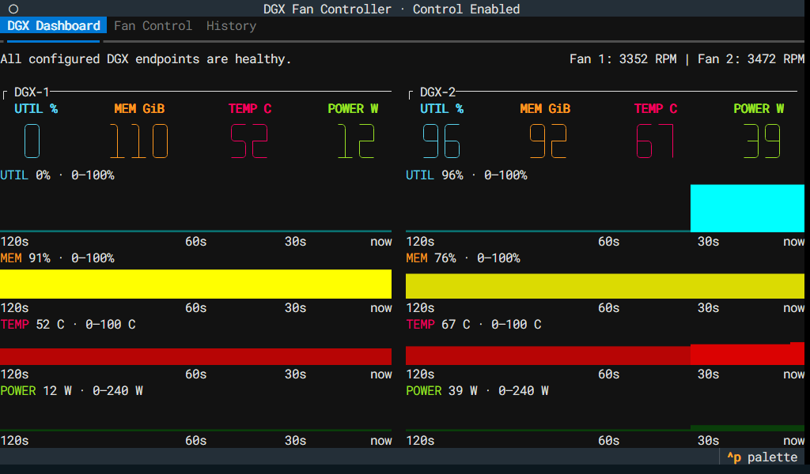
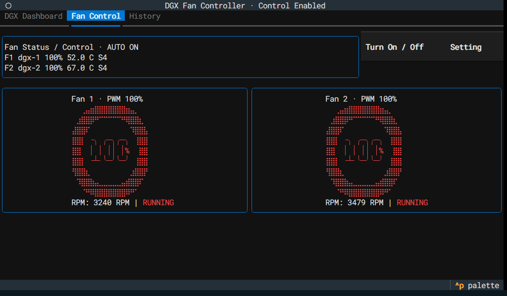
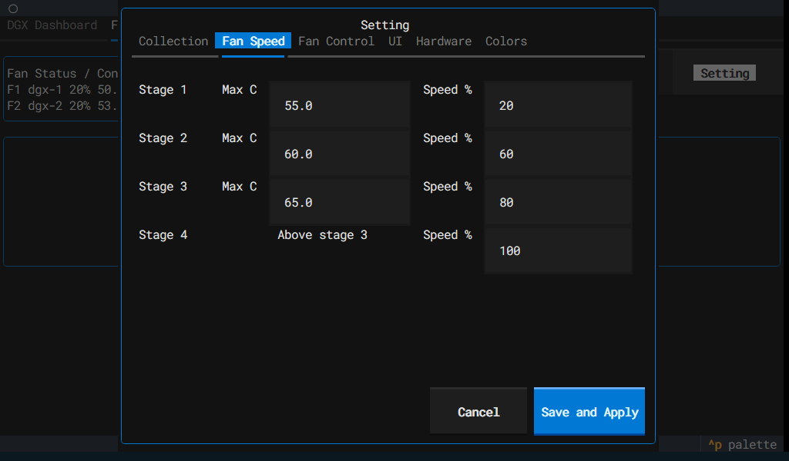
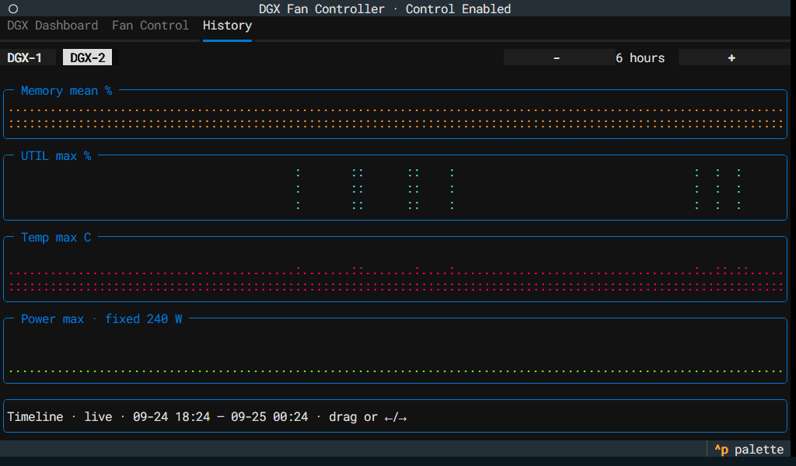

# DGX Fan Controller TUI (MVP)

[한국어 README](README.ko.md)

`dgx-fan-control` began with a question while building a case for the DGX Spark: "Could its temperature control the fans?"


To keep the hardware simple, I used Noctua NF-A6x25 5V PWM fans and a Raspberry Pi 4.
(The fans receive power directly from the Raspberry Pi 4's 5V pins, while PWM controls their speed.)

I used a 7-inch 1024x600 Raspberry Pi touch display for the dashboard, but it is not required just to control the fans because the display can also be viewed in a web browser.

The DGX Spark needs DCGM exporter and [node_exporter](https://github.com/prometheus/node_exporter) installed. DCGM exporter normally provides GPU information, but for the DGX Spark's unified memory this app obtains memory information indirectly from node_exporter.

## Install and run (Raspberry Pi)

Install [`uv`](https://docs.astral.sh/uv/getting-started/installation/) first, then clone the project and run the installer as your regular login user.

### Create config.toml

```bash
cp config.example.toml config.toml
```

Enter your DGX exporter URL and fan connections in `config.toml`. For real operation on a Raspberry Pi 4, change `[hardware] backend = "fake"` to `[hardware] backend = "raspberry-pi"`. To use the web monitor, change `[web] enabled = false` to `[web] enabled = true`. See the [configuration guide](docs/configuration.md) for the settings and the [Raspberry Pi wiring guide](docs/raspberry-pi-wiring.md) before connecting a real fan.

### Install and uninstall

```bash
./install.sh --no-launch
```

Use `--no-launch` to install first and launch the app yourself. To uninstall, run this separate command:

```bash
./uninstall.sh
```

### Start and stop

```bash
./dgx-fan-control.sh
Choose the primary TUI display:
  1) Current terminal
  2) HDMI: labwc + fullscreen LXTerminal
  3) HDMI: Linux console (tty8 fallback)
  h) Help
  q) Cancel
Choice [1/2/3]: 2
Start the optional web monitor? [y/N] y
Running as unit: dgx-fan-web.service; invocation ID: f2f86be3d29648e69b17eba39f47969b
Browser monitor: http://192.168.1.7:8000/
```

The launcher asks you to select a display option.

| Menu | When to choose it |
| --- | --- |
| `1` | Run in the current terminal or SSH session; closing that terminal may stop the app. |
| `2` | Recommended graphical HDMI display, with richer glyphs and colors; requires labwc and LXTerminal. |
| `3` | Linux console on tty8 without a graphical environment; font and color rendering are limited. |
| `h` / `q` | Show help / cancel launch. |

The subsequent web-monitor prompt is optional. `stop` stops managed web and HDMI displays; quit an app running in the current terminal with **Ctrl+Q**. See the [usage guide](docs/usage.md) for detailed start, stop, and troubleshooting instructions.

```bash
./dgx-fan-control.sh stop
```

## Screenshots






## Testing limits

The tested Raspberry Pi setup used a Raspberry Pi 4 stock image running `Debian GNU/Linux 13 (trixie)`, configured to log in to the console rather than a GUI at boot for automatic launch. This records the tested environment, not a required OS version.

I have tested only on the devices I own, so other devices may encounter errors.
